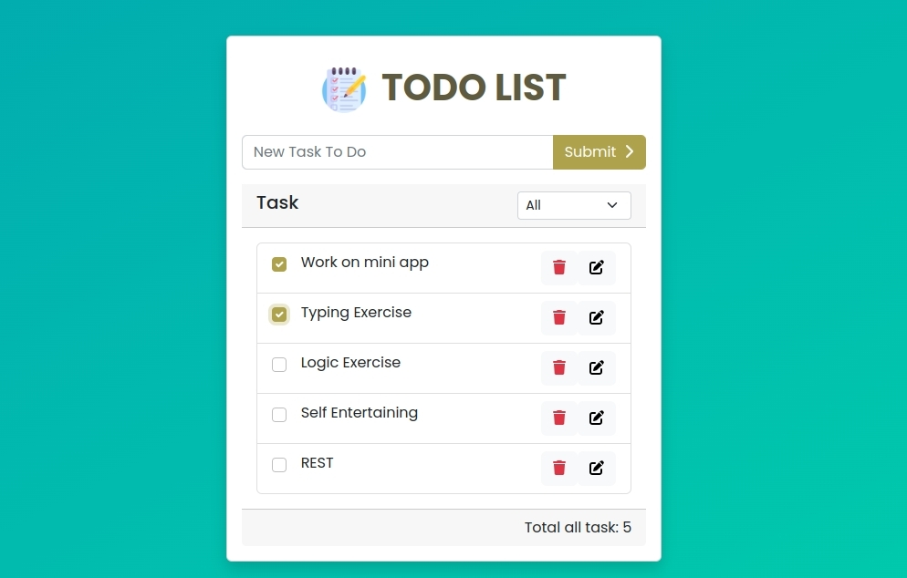

# Todo List App

A Todo List Application with almost complete feutures
**Live demo: [https://naufal18-bot.github.io/react-todo-list/](https://naufal18-bot.github.io/react-todo-list/)**

## Project Description

In this project, I created a todo list application with almost complete features. The data stored inside the application is temporary, so whenever the browser refresh, the data will be removed.

## Available Scripts

In the project directory, you can run:

### `npm start`

Runs the app in the development mode.\
Open [http://localhost:3000](http://localhost:3000) to view it in your browser.

The page will reload when you make changes.\
You may also see any lint errors in the console.

### `npm test`

Launches the test runner in the interactive watch mode.\
See the section about [running tests](https://facebook.github.io/create-react-app/docs/running-tests) for more information.

## What I learned from this project

- [React](https://reactjs.org)
- [Bootstrap 5.2](https://getbootstrap.com)
- [Font Awesome](https://fontawesome.com)

## Thanks To

[Freepik](https://www.flaticon.com/authors/freepik)
